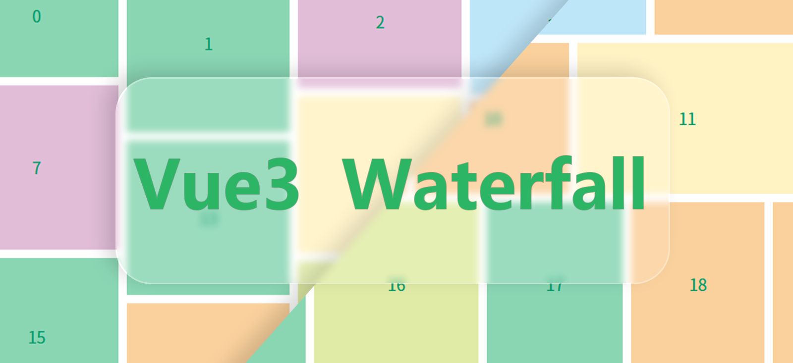

# vue-waterfall

A waterfall layout component for Vue3.js .

The address of the waterfall component of vue2 version is [vue-waterfall](https://github.com/MopTym/vue-waterfall).

The warehouse is an upgraded version of [vue-waterfall](https://github.com/MopTym/vue-waterfall) replica. Advantages, support vue3 version

## Effect Preview

- [Vertical line](http://app.moptym.com/vue-waterfall/demo/vertical-line.html)
- [Horizontal line](http://app.moptym.com/vue-waterfall/demo/horizontal-line.html)
- [Vertical line with grow](http://app.moptym.com/vue-waterfall/demo/vertical-line-with-grow.html)

## Installation

```shell
npm install --save vue3-waterfalllayout
```
